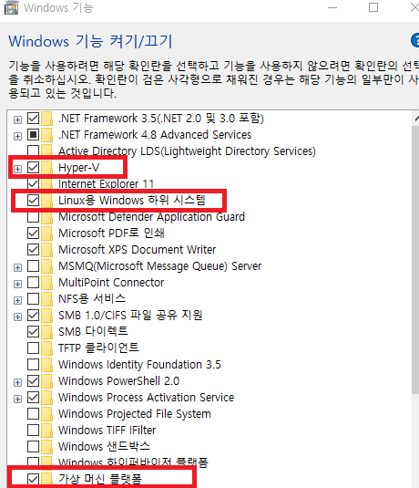
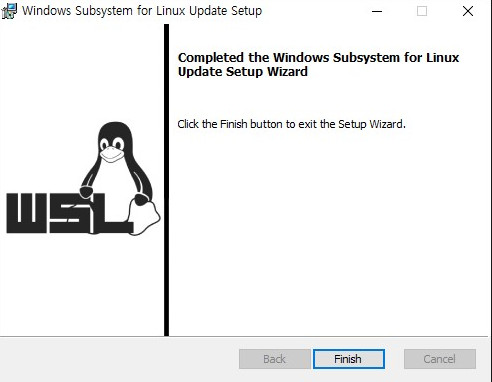
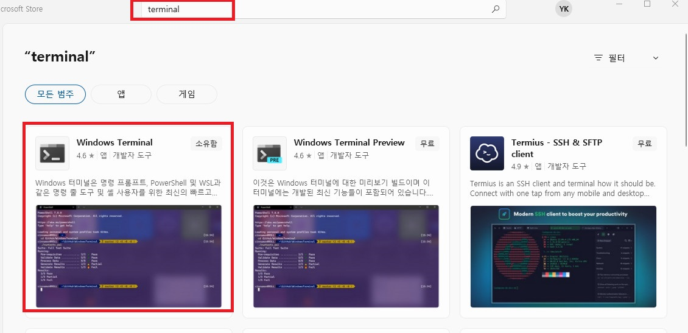
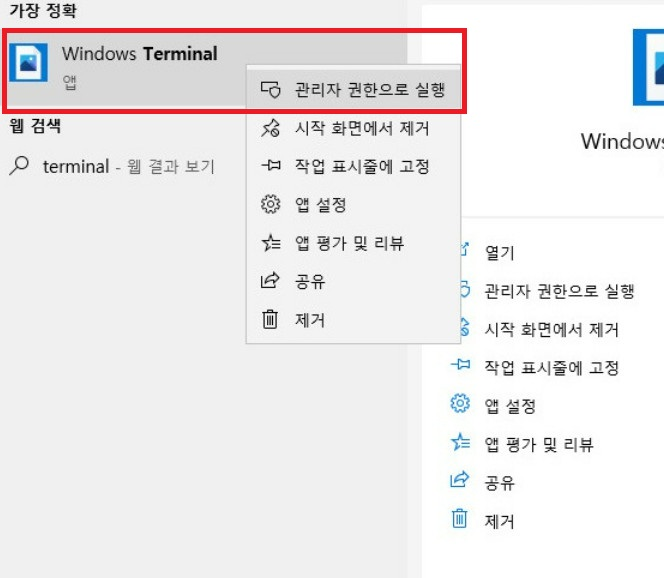

# Docker 실습환경 준비

## Windows 기능 켜기/끄기

- **WSL2 실행을 위한 시스템 요구사항 확인**
  - WSL 2로 업데이트하려면 Windows 10을 실행해야 합니다.
  - x64 시스템의 경우: 버전 1903 이상, 빌드 18362 이상
  - 18362보다 낮은 빌드는 WSL 2를 지원하지 않습니다. Windows Update Assistant를 사용하여 Windows 버전을 업데이트합니다.
  - 버전 및 빌드 번호를 확인하려면 Windows 로고 키 + R 을 선택하고, winver 를 입력하고, 확인 을 선택합니다. [설정] 메뉴에서 최신 Windows 버전으로 업데이트합니다.

## Windows 기능 켜기/끄기 실행
- 윈도우의 검색기능을 이용해 'Windows 기능 켜기/끄기'를 실행한다. 


  

- 'Linux 용 Windows 하위 시스템', '가상 머신 플랫폼' 및 Hyper-V 기능 활성화

  

- 기능 활성화 후, PC 재시작


## WSL2 로 커널 업데이트

- [WSL2 커널 업데이트 다운](https://wslstorestorage.blob.core.windows.net/wslblob/wsl_update_x64.msi)

- WSL2커널 업데이트 후 모습

   

  * 설치 오류시, 위 절차의 Windows 기능 켜기/끄기를 비활성화 후 PC 재부팅 한뒤, 다시 처음 절차부터 수행하여 커널 업데이트를 해보세요.


## Windows Terminal 설치

 - Microsoft Store에서 'terminal' 검색후, 터미널 설치

   

## WSL 기본 버전을 WSL2로 변경

- Terminal을 관리자 모드(마우스 오른쪽 버튼 클릭후, 관리자 모드 수행)로 실행

   

- Terminal에서 WSL2를 기본 버전으로 변경

  ```
  wsl --set-default-version 2
  ```

## Ubuntu 설치

 - Microsoft store에서 Ubuntu 설치

    

## Docker Desktop 설치

 - [Docker 공식홈페이지](https://desktop.docker.com/win/main/amd64/135262/Docker%20Desktop%20Installer.exe?_gl=1*1nmfr0b*_gcl_au*NDcwODQ0NTY0LjE3MjQ5MDc0Nzc.*_ga*MjQxMTA3MDcuMTY5MDI1NDEzMQ..*_ga_XJWPQMJYHQ*MTcyNTM0MTE2NS4xNC4xLjE3MjUzNDEyNjguNjAuMC4w)에서 Docker Desktop 다운로드
   
   * Docker Desktop Ver.4.270


# Ubuntu 상에서의 Docker 명령어 수행

## Nginx 컨테이너 실행하기

- docker pull 로 docker.hub 에서의 이미지를 당겨와 받고 수행할 수 있음

  ```
  docker pull nginx
  ```
- docker run 명령어를 사용하여 이미지를 당겨와 바로 수행할 수 있음


  ```
  docker run -d -p 8080:80 --name my-nginx nginx
  ```


- docker ps 명령어를 이용하여 수행중인 docker 컨테이너 목록을 조회해 봄


  ```
  docker ps
  ```

- docker exec -it my-nginx 를 사용하여 수행중인 컨테이너 안으로 들어갈 수 있음


  ```
  docker exec -it my-nginx /bin/bash
  ```


- docker images 명령어를 사용해 시스템에서 다운받은 docker image 리스트를 조회해 볼 수 있음

  ```
  docker images
  ```
- docker stop을 이용해 수행중인 컨테이너를 종료 시킬 수 있음

  ```
  docker stop my-nginx
  ```

- docker rmi 를 이용해 도커 이미지를 시스템에서 삭제할 수 있음

  ```
  docker rmi nginx
  ```

# Docker image 빌드 하기

- 초기의 ubuntu 16.04 를 docker Run을 통해 다운 받고 수행해 본다.

  ```
  docker run -it ubuntu:16.04 /bin/bash
  ```

- 새로 다운 받은 ubuntu 에서 python이 개발환경이 설치되어 있지 않은 것을 확인한다.

  ```
  python -V
  ```

- 도커 컨테이너를 빠져 나온다.

  ```
  exit
  ```


- vi 편집기를 이용해 Dockerfile 이라는 파일명의 파일을 생성한다.

  ```
  vi Dockerfile
  ```


- base image를 직전에 다운받은 ubuntu:1604로 해서 파이썬 개발 환경을 이미지 스택으로 하나 더 쌓는다


  ```
  FROM ubuntu:16.04

  RUN apt-get update -y && \
              apt-get install -y python-pip python-dev
  ```

- 도커 이미지를 빌드한다. 이때 도커 이미지 이름은 `cuk:latest`

  ```
  docker build -t cuk-practice:latest
  ```
